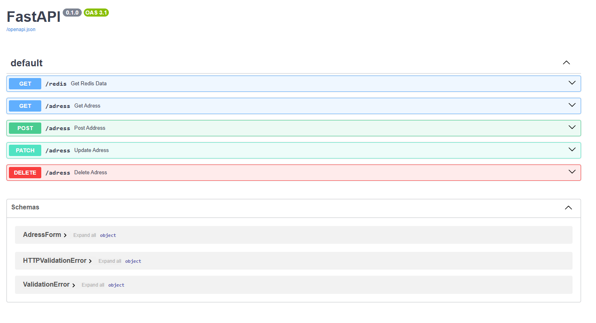
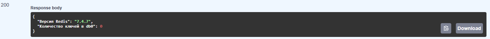

# ТЗ

Разработать микросервис для хранения и управления связками "телефон-адрес".

## Требуемые эндпоинты для работы с телефонами и адресами:
### 1. Просмотр данных

`Цель`: Получить сохранённый адрес по номеру телефона. Используется для быстрой проверки наличия данных и извлечения адреса клиента.

`Описание`: Возвращает адрес, связанный с указанным номером телефона. Данные извлекаются из Redis по ключу phone.

`Ожидаемый ответ`:
Если телефон найден — адрес в формате JSON (HTTP 200)
Если не найден — HTTP 404

### 2. Создание новой записи

`Цель`: Зарегистрировать новую связку телефон-адрес в системе. Используется при первом обращении клиента или регистрации нового пользователя.

`Описание`: Создаёт новую связку телефон-адрес. Сохраняет данные в Redis, используя номер телефона в качестве ключа.

`Тело запроса` (JSON):

* phone — номер телефона

* address — адрес

`Ожидаемое поведение`:

* Если телефон уже существует — HTTP 409 (Conflict) или обновление данных

* Если создано успешно — HTTP 201 (Created)

### 3. Обновление существующей записи

`Цель`: Актуализировать адрес клиента. 
Используется когда клиент переехал или изменил адрес доставки.

`Описание`:

Обновляет адрес для указанного номера телефона.

`Тело запроса` (JSON):
address — новый адрес

`Ожидаемое поведение`:

* Если телефон существует — обновляет адрес, возвращает HTTP 200

* Если телефон не найден — HTTP 404


### 4. Удаление записи (опционально)

`Цель`: Удалить устаревшие или ошибочные данные из системы.

`Описание`: Удаляет запись из Redis.

`Ожидаемое поведение`:

* Если запись существовала и удалена — HTTP 204 (No Content)
* Если запись не найдена — HTTP 404


--- 

## Стркуктура проекта 

```
app/
    services/
        db.py ----> реализация коннектора к db
    main.py ------> описание эндпонтов/схем
    config.py ----> Валидация .env file 
    .env----------> HSOT / PORT редиса !не в .gitignore
    Dockerfile
```


# Запуск проекта в Docker
из `src` 
```bash 
docker compose up -d  
```

# Запуск локально 
Создание виртуального окружения
```bash
python3 -m venv venv 
```
Активация виртуального окружения
```bash
source venv/bin/activate
```

```bash
cd app/
```

Установка завсимостей
```bash
pip install -r requirements.txt
```

Запуск сервера
```bash
uvicorn main:app --reload --host 0.0.0.0 --port 8000
```


# .env структура 

```python
RedisHost: str 
RedisPort: int
```


# docs 

### http://localhost:8000/docs



# ps
реализован endpoint `/redis`

